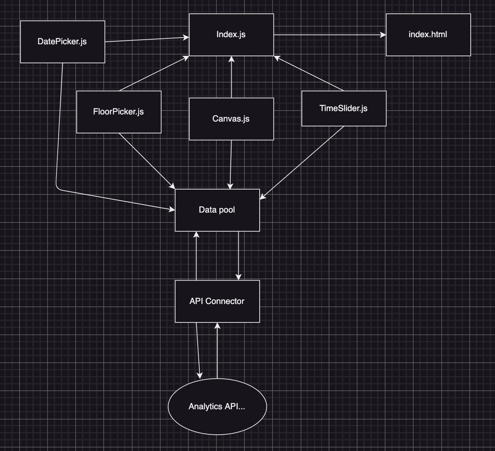

# Project Title

RIMAC data visualization web app.

## Description

This project is aimed to provide useful visualizations of RIMAC gym visitors at UC San Diego.

## Getting Started
\
Click [here](https://effortless-licorice-b5ddb3.netlify.app/) for current prod version.

## For developers

Pull requests have deploy previews. Please make sure nothing is broken on prod before merging.\
Prod branch would have most recent updates, hosted on Netlify.\
Live branch is protected(need PR + 1 review to push) - hosting TBD.

### System Design

## Adopted Convetions

CUBE CSS - naming convention

## Authors

Contributors names and contact info (feel free to add your name below)

Dzhangir Bayandarov
...

## License

This project is licensed under the MIT License

## Acknowledgments

Inspiration, code snippets, etc.
* [awesome-readme](https://github.com/matiassingers/awesome-readme)
* [PurpleBooth](https://gist.github.com/PurpleBooth/109311bb0361f32d87a2)
* [dbader](https://github.com/dbader/readme-template)
* [zenorocha](https://gist.github.com/zenorocha/4526327)
* [fvcproductions](https://gist.github.com/fvcproductions/1bfc2d4aecb01a834b46)